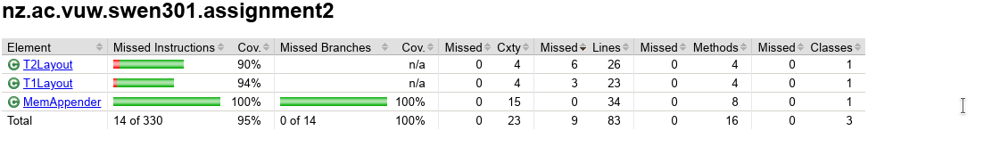

<h1>Question a.</h1> 

**Any special Instructions to run the tests (if needed)**

All of the test can be run by 'mvn clean test' in terminal. However, for question 9 regarding MBean only MemAppender is monitored.
Therefore when marking question 9 it may be easier to run the MemAppenderStressTest individually so you can open JConsole to check.

<h1>Question b.</h1>

**A reflection on the test coverage reports (in particular, an explanation why certain parts of the code are not covered). Insert a summary of the reports (e.g., embed a screenshot)**

My test coverage for this assignment is as follows.

Certain parts of T1Layout and T2Layout are not covered, specifically in the format methods where File IO, Parsers or Templates are required.

in the format method in my T1Layout the catch(ParseException e) is never accessed. I attempted to cover this however, because format is never called directly 
by any method and my T2Layout is always passed in a String on construction which is passed into RunTimeServices.parse. Creating a layout with a null String will 
just result in a null pointer exception. Therefore ParseException could never be reached, as the program would only compile by passing in a string or null.

in the format method in my T2Layout, I have 2 catch exceptions which are never accessed. The first one is IOException which catches IOException when
using StringReader and StringWriter. I can never reach an IOException with StringReader because I always pass a String into StringReader and passing in null
wil just result in a nullpointer exception. I also cannot reach an IOException with StringWriter, as I never call the format method directly and could only get an
IOException if I tried to process a closed StringWriter.

The second catch exception never accessed in my T2 Layout is the Template Exception. This is because both parameters passed into Template.process(Object, Writer)
are always valid. the first parameter is a hashmap which is always created at the start of my method and a new StringWriter is made for each time format is called,
therefore TemplateException will never be reached.

<h1>Question c.</h1> 

**An evaluation which of the layouts, T1Layout or T2Layout, you recommend for use.**
**Base your decision on your experience (ease of use),technical aspects (e.g. performance as shown in the stress tests, stability, number and size of direct and indirect dependencies),**
**and social aspects (size and activity of developer community, license, support like mailing lists and stackoverflow topics, usage by others, …) **

I personally found Velocity(T1Layout) easier to use compared to FreeMarker(T2Layout). Based on personal experience Velocity seems like a more straightforward
layout to complete the task given. This was due to the configuration settings that FreeMarker provides which didn't really benefit this particular assignment, 
whereas Velocity keeps it simple with just requiring a VelocityContext to log Strings. In terms of performance, using the same Template format, my velocity layout
processed 7719189 logs compared to FreeMarker which processed 2097218 logs. I think FreeMarker may have underperformed due to having to set configuration settings
for each time format was called and also dynamically storing a new HashMap each time format is called.

In terms of stability, I do think Velocity is more stable 
due to the fact that in Freemarker you can change configuration settings to handle different charset encoding, versions, exception handlers
and which exceptions to log, which adds more complexity that could cause issues when logging.
I also found that creating templates with FreeMarker was slightly easier than Velocity for this task
because Velocity requires runtimeServices to generate templates.

In terms of Social Aspects, I found that velocity seems to have a larger user base. This may be down to it being a more fast and stable engine so it feels more
familiar for most logging tasks. When searching both velocity and freemarker on stack overflow by newest, I found freemarker to have more recent posts but this 
boil down to freemarker being more complex and users having more uncertainties. In terms of development, FreeMarker has a larger development community due to the 
complexity of the engine whereas velocity requires a smaller development community as it remains fixed stable and usable. Both Velocity and FreeMarker are on version
2.0 and were licensed in January 2004. However the maven directory only had a dependancy as far as 1.7 where freemarker went up to 2.3.28. 

